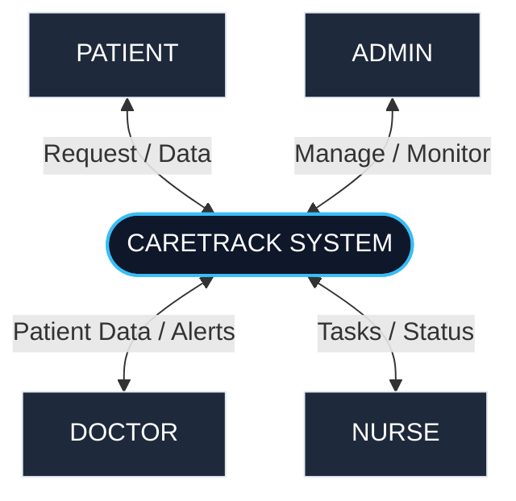

# 🏥 CareTrack
**CareTrack** is a web-based **Remote Patient Follow-Up and Nurse Management System** designed to improve post-treatment healthcare management. It enables doctors, nurses, and patients to stay connected through an interactive, centralized platform, simplifying patient monitoring, follow-up planning, digital prescription management, and emergency alert handling.
Developed as an academic project for the Master of Computer Applications (MCA) curriculum.
---
## 📖 Overview
Many hospitals and clinics rely on manual methods for patient follow-up, resulting in missed appointments, delayed interventions, and inefficient communication. CareTrack addresses these challenges by providing a secure and centralized platform where healthcare professionals can remotely monitor patients and respond quickly to abnormal health conditions.
This project is structured as a **Monorepo** consisting of:
1. **Frontend**: An immersive, high-fidelity **React 19 + Vite** Single Page Application (SPA) styled with **Tailwind CSS**. It incorporates advanced UI/UX technologies such as **GSAP** (ScrollTrigger animations), **Lenis** (smooth scrolling), and **Three.js / React Three Fiber** (3D interactive landing page elements) for a premium user experience. All data state and role interactions are simulated in real-time using a seeded mock database (`mockData.js`) and **Local Storage** persistence, allowing for a fully functional, zero-database-setup demonstration.
2. **Backend**: A **Node.js + Express** server skeleton designed to serve as the API foundation for future production database integration.
---
## ✨ Features by User Role
CareTrack uses **Role-Based Access Control (RBAC)** to provide dedicated interfaces and features for four user roles:
### 👨‍💼 Admin Dashboard
*   **User Approval**: Review and approve/reject pending registrations for Doctors, Nurses, and Patients.
*   **Staff Assignment**: Assign patients to doctors and assign nurses to doctors/departments.
*   **System Settings**:
    *   **Global Maintenance Mode**: Toggle a system-wide maintenance page that dynamically redirects all non-admin users.
    *   **System Renaming**: Rename the entire application branding globally in real-time.
*   **System Analytics**: View live statistics and patient status breakdowns.
*   **Activity Logs**: Monitor system activities and audit logs.
### 🩺 Doctor Dashboard
*   **Patient Monitoring**: View all assigned patients, their conditions, and vitals adherence.
*   **Interactive Vitals Charts**: Review historical patient vitals (Heart Rate, Blood Pressure, SpO2, Temperature, Blood Sugar) plotted on interactive charts using **Recharts**, with automated threshold warnings.
*   **Follow-Up Plans**: Design custom follow-up plans, defining target vitals thresholds, check-in frequencies, and active medications.
*   **Digital Prescription Generator**: Generate and digitally sign prescriptions. Exports to PDF via **jsPDF** with an embedded, unique **verification QR code**.
*   **Emergency Alerts**: Receive instant visual alerts when a patient logs abnormal vitals.
*   **Direct Chat**: Communicate with assigned patients and assisting nurses through an integrated chat window.
### 👩‍⚕️ Nurse Dashboard
*   **Patient Tracking**: View all assigned patients organized by their respective doctors.
*   **Vitals Review**: Monitor patient daily check-ins and review clinical trends.
*   **Clinical Observations**: Add observation notes and update patient status.
*   **Alert Response**: Acknowledge and manage critical health alerts.
*   **Direct Chat**: Coordinate care with doctors and patients.
### 🧑‍🤝‍🧑 Patient Dashboard
*   **Daily Log Submission**: Log daily health vitals (Systolic/Diastolic BP, Heart Rate, SpO2, Temperature, Blood Sugar) and symptom reports.
*   **Follow-Up Plan Tracker**: View active follow-up plans, schedules, and doctor guidelines.
*   **Prescription Hub**: View and download digital prescriptions as PDFs.
*   **QR Verification**: Verify prescription authenticity using the built-in verification route.
*   **Care Team Chat**: Directly message assigned doctors and nurses.
---
## 🛠️ Technology Stack
### Frontend
*   **Framework**: React 19 (Vite)
*   **Styling**: Tailwind CSS, PostCSS
*   **Animations & Motion**:
    *   **GSAP (GreenSock)** & **ScrollTrigger**: For text reveals, card fanning, and scroll-bound animations.
    *   **Lenis**: For smooth momentum scrolling.
    *   **Three.js** & **React Three Fiber**: For 3D interactive landing page elements.
*   **Data Visualization**: Recharts (interactive vitals charts)
*   **Document Generation**: jsPDF & jsPDF-AutoTable (PDF prescriptions)
*   **Utilities**: Lucide React (icons), CryptoJS (simulated password hashing), qrcode.react (prescription verification QR codes)
*   **Routing**: React Router DOM (v7)
### Backend (API Skeleton)
*   **Runtime**: Node.js
*   **Framework**: Express.js
*   **Utilities**: CORS, dotenv, nodemon
### Monorepo Orchestration
*   **Concurrently**: Runs both the frontend Vite dev server and backend Express server with a single command.
---
## 📂 Project Structure
```
caretracknurse/
│
├── backend/                  # Node.js + Express backend skeleton
│   ├── config/               # Database and app configurations (extensible)
│   ├── models/               # Database models (extensible)
│   ├── routes/               # Express API routes (extensible)
│   ├── src/                  # Additional source files
│   ├── package.json          # Backend dependencies
│   └── server.js             # Entry point for backend server
│
├── frontend/                 # React 19 + Vite frontend (fully featured SPA)
│   ├── public/               # Static assets
│   ├── src/
│   │   ├── components/       # Custom UI components (SmoothScroll, CustomCursor, ChatWindow, TheaterEffect)
│   │   ├── data/             # Mock database & state simulation (mockData.js)
│   │   ├── pages/            # Role-based Dashboards (Admin, Doctor, Nurse, Patient) and Pages (Home, Login, Register, VerifyPrescription, Settings)
│   │   ├── App.jsx           # Main application routing & global state
│   │   ├── index.css         # Tailwind directives & global styles
│   │   └── main.jsx          # React entry point
│   ├── package.json          # Frontend dependencies (React, GSAP, Recharts, jsPDF)
│   ├── tailwind.config.js    # Tailwind layout customizations
│   └── vite.config.js        # Vite build configuration
│
├── docs/                     # Academic documentation & diagrams
│   ├── CareTrack_DFD_System.pdf
│   ├── dfd_report.md         # Detailed DFD description
│   ├── schema.html           # Database schema outline
│   └── *_level_1.pdf         # Role-specific PDF DFDs
│
├── package.json              # Monorepo configuration (concurrent script runner)
└── README.md                 # Project documentation
```
---
## 📊 Data Flow Diagrams (DFD)
The following diagrams illustrate how data flows through the CareTrack system.
### Level 0 DFD (System Overview)

### Level 1 DFD (Patient & Doctor Interaction)
For detailed level 1 DFDs of each role (Admin, Doctor, Nurse, and Patient), please refer to the markdown report in [docs/dfd_report.md](file:///docs/dfd_report.md) or the PDF files in the [docs/](file:///docs/) directory.
---
## 🔄 Workflow
1.  **Registration**: A Patient, Doctor, or Nurse registers on the platform.
2.  **Verification**: The Admin logs in, reviews the registration details (including Knmc registration/medical license numbers for staff), and approves the accounts.
3.  **Assignment**: The Admin assigns the approved Patient to a Doctor, and assigns assisting Nurses to that Doctor's department.
4.  **Follow-Up Plan**: The Doctor creates a customized follow-up plan for the patient, specifying medication and vital thresholds.
5.  **Daily Check-In**: The Patient logs in daily to submit their vitals (Heart Rate, BP, SpO2, Blood Sugar, Temperature).
6.  **Alert Triggering**: If a patient's vitals violate the thresholds defined in their plan, the system automatically triggers an emergency alert.
7.  **Alert Handling & Treatment**: Both the Doctor and Nurse receive a high-priority alert. The Doctor reviews the vitals history chart, coordinates with the Nurse, and creates a digital prescription.
8.  **Prescription Verification**: The Patient downloads the prescription as a PDF. Pharmacists or third parties can scan the embedded QR code to access the verification route (`/verify-prescription/:id`) to verify its authenticity.
---
## 🚀 Getting Started
Follow these steps to set up and run CareTrack locally.
### Prerequisites
*   [Node.js](https://nodejs.org/) (v18 or higher recommended)
*   npm (installed automatically with Node.js)
### Installation
1.  Clone the repository or navigate to the project directory:
    ```bash
    cd caretracknurse
    ```
2.  Install dependencies for the entire project (root, frontend, and backend):
    ```bash
    npm install
    ```
    *(This will install the root dependencies. To ensure both frontend and backend are fully installed, you can also run `npm install` inside the `frontend` and `backend` directories).*
### Running the Application
To run both the **React Frontend** and the **Express Backend** concurrently in development mode:
```bash
npm run dev
```
*   **Frontend**: Opens at [http://localhost:5173](http://localhost:5173)
*   **Backend API**: Runs at [http://localhost:5000](http://localhost:5000)
---
## 🛡️ Simulation & Testing Credentials
Since the system uses local storage and pre-seeded mock data, you can test all roles immediately using these pre-registered accounts:
|
 Role 
|
 Email 
|
 Password 
|
 Details 
|
|
:---
|
:---
|
:---
|
:---
|
|
**
Admin
**
|
`admin@system.com`
|
*
Any password
*
|
 Dr. Sarah Johnson 
|
|
**
Doctor
**
|
`dr.chen@system.com`
|
*
Any password
*
|
 Dr. Michael Chen (Cardiology) 
|
|
**
Nurse
**
|
`nurse.brown@system.com`
|
*
Any password
*
|
 Nurse Jessica Brown 
|
|
**
Patient
**
|
`john.smith.p101@email.com`
|
*
Any password
*
|
 John Smith (Post-Cardiac Surgery) 
|
*Note: For ease of testing in the development/demo environment, any password will be accepted for the pre-seeded accounts.*
---
## 👨‍💻 Developer
**Abhi Jith**  
Master of Computer Applications (MCA)  
---
## 📄 License
This project was developed for academic purposes as part of the MCA curriculum.
