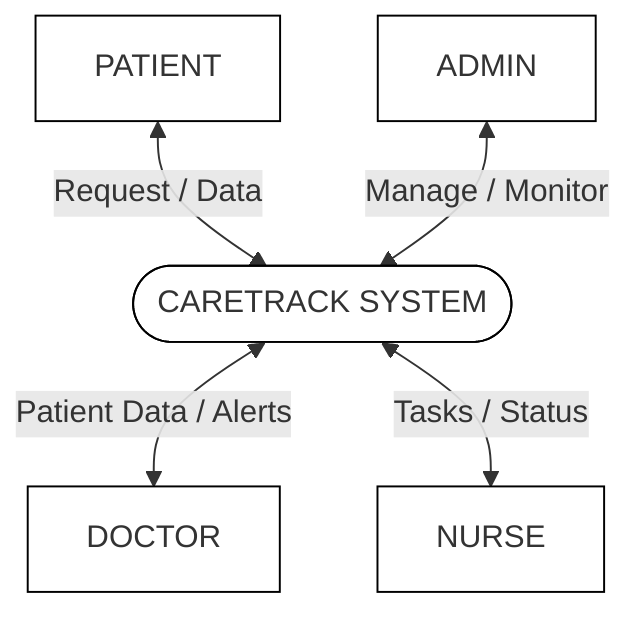
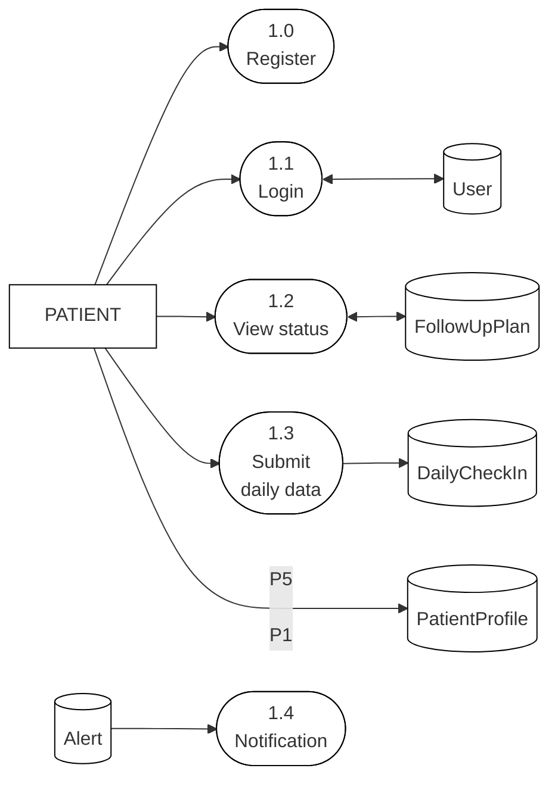
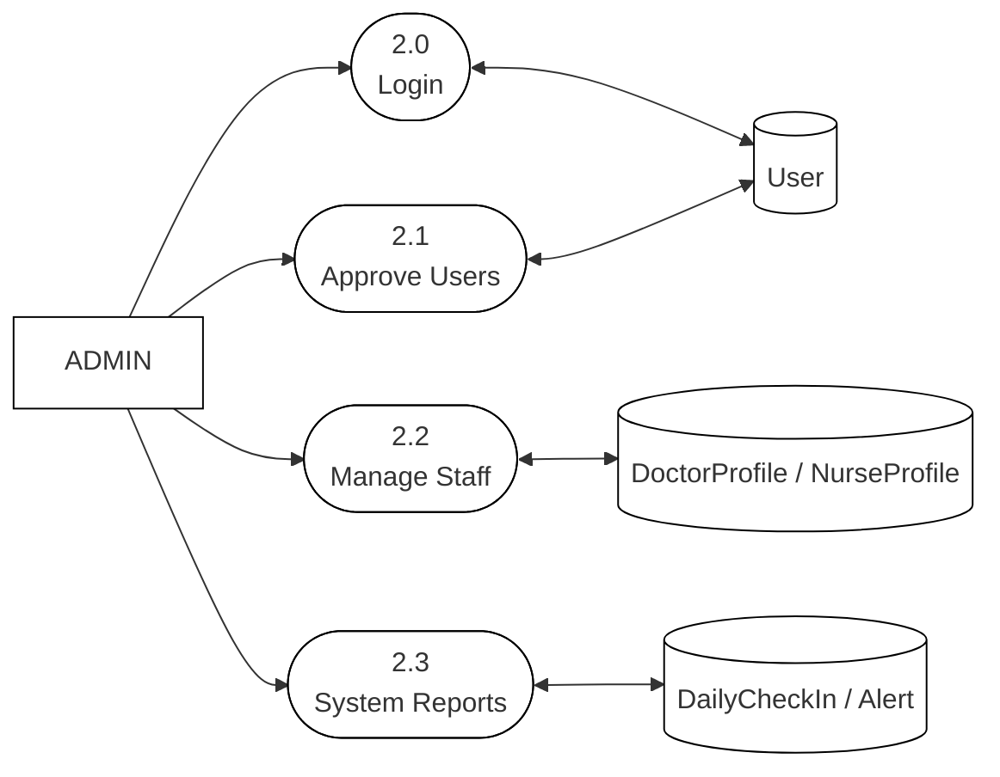
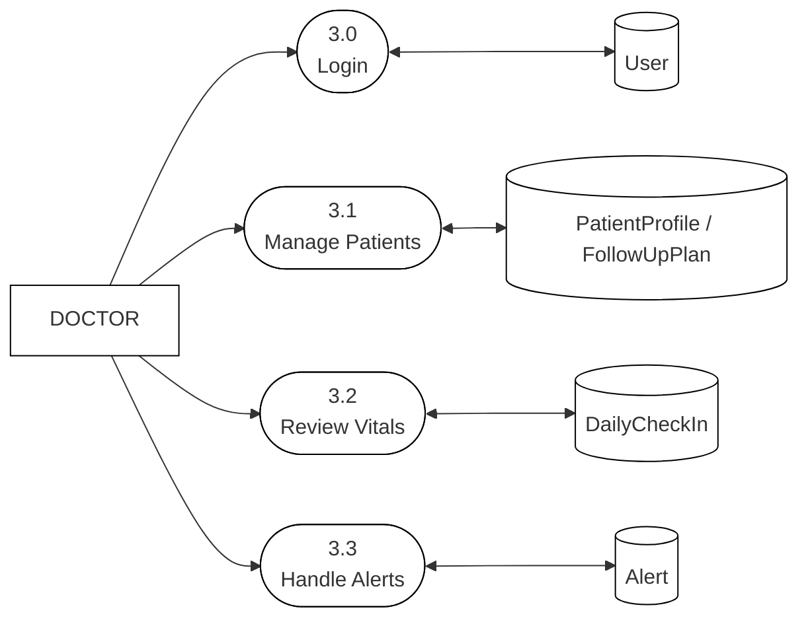
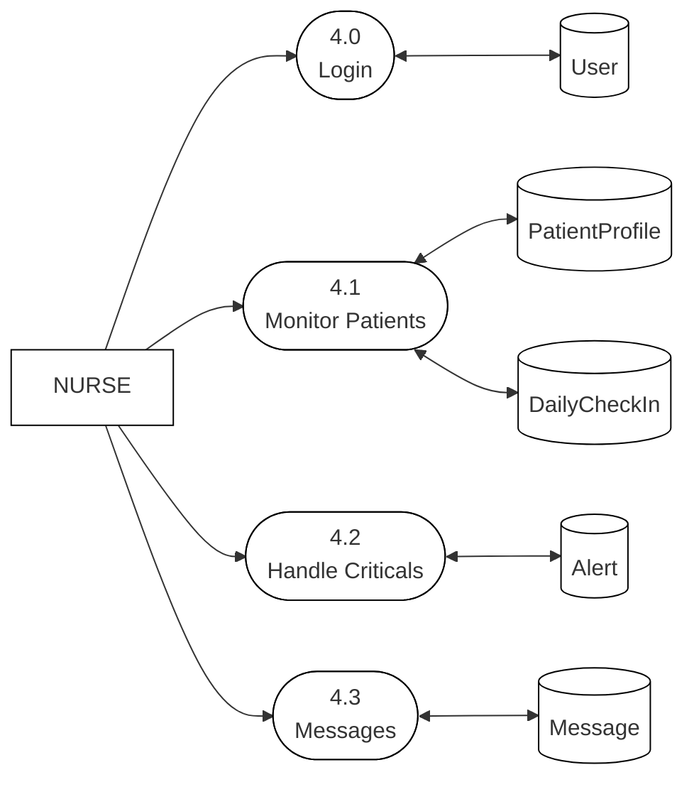

# CareTrack System - Data Flow Diagrams

## Level 0 DFD

```mermaid
flowchart TD
    classDef process fill:#fff,stroke:#000,stroke-width:1px,rx:50,ry:50;
    classDef entity fill:#fff,stroke:#000,stroke-width:1px;

    PATIENT[PATIENT]:::entity
    ADMIN[ADMIN]:::entity
    DOCTOR[DOCTOR]:::entity
    NURSE[NURSE]:::entity
    CARETRACK([CARETRACK SYSTEM]):::process

    PATIENT <-->|"Request / Data"| CARETRACK
    ADMIN <-->|"Manage / Monitor"| CARETRACK
    CARETRACK <-->|"Patient Data / Alerts"| DOCTOR
    CARETRACK <-->|"Tasks / Status"| NURSE
```

## Level 1 DFDs

### 1. Patient Level 1 DFD

```mermaid
flowchart LR
    classDef process fill:#fff,stroke:#000,stroke-width:1px;
    classDef ellipse fill:#fff,stroke:#000,stroke-width:1px,rx:50,ry:50;
    classDef ds fill:#fff,stroke:#000,stroke-width:1px;
    
    PATIENT[PATIENT]:::process
    
    P1([1.0<br/>Register]):::ellipse
    P2([1.1<br/>Login]):::ellipse
    P3([1.2<br/>View status]):::ellipse
    P4([1.3<br/>Submit<br/>daily data]):::ellipse
    P5([1.4<br/>Notification]):::ellipse
    
    D1[(PatientProfile)]:::ds
    D2[(User)]:::ds
    D3[(FollowUpPlan)]:::ds
    D4[(DailyCheckIn)]:::ds
    D5[(Alert)]:::ds
    
    PATIENT --> P1
    PATIENT --> P2
    PATIENT --> P3
    PATIENT --> P4
    PATIENT <-- P5
    
    P1 <--> D1
    P2 <--> D2
    P3 <--> D3
    P4 --> D4
    D5 --> P5
```

### 2. Admin Level 1 DFD

```mermaid
flowchart LR
    classDef process fill:#fff,stroke:#000,stroke-width:1px;
    classDef ellipse fill:#fff,stroke:#000,stroke-width:1px,rx:50,ry:50;
    classDef ds fill:#fff,stroke:#000,stroke-width:1px;

    ADMIN[ADMIN]:::process
    
    A1([2.0<br/>Login]):::ellipse
    A2([2.1<br/>Approve Users]):::ellipse
    A3([2.2<br/>Manage Staff]):::ellipse
    A4([2.3<br/>System Reports]):::ellipse
    
    D1[(User)]:::ds
    D2[(DoctorProfile / NurseProfile)]:::ds
    D3[(DailyCheckIn / Alert)]:::ds
    
    ADMIN --> A1
    ADMIN --> A2
    ADMIN --> A3
    ADMIN --> A4
    
    A1 <--> D1
    A2 <--> D1
    A3 <--> D2
    A4 <--> D3
```

### 3. Doctor Level 1 DFD

```mermaid
flowchart LR
    classDef process fill:#fff,stroke:#000,stroke-width:1px;
    classDef ellipse fill:#fff,stroke:#000,stroke-width:1px,rx:50,ry:50;
    classDef ds fill:#fff,stroke:#000,stroke-width:1px;

    DOCTOR[DOCTOR]:::process
    
    D1([3.0<br/>Login]):::ellipse
    D2([3.1<br/>Manage Patients]):::ellipse
    D3([3.2<br/>Review Vitals]):::ellipse
    D4([3.3<br/>Handle Alerts]):::ellipse
    
    DB1[(User)]:::ds
    DB2[(PatientProfile / FollowUpPlan)]:::ds
    DB3[(DailyCheckIn)]:::ds
    DB4[(Alert)]:::ds
    
    DOCTOR --> D1
    DOCTOR --> D2
    DOCTOR --> D3
    DOCTOR --> D4
    
    D1 <--> DB1
    D2 <--> DB2
    D3 <--> DB3
    D4 <--> DB4
```

### 4. Nurse Level 1 DFD

```mermaid
flowchart LR
    classDef process fill:#fff,stroke:#000,stroke-width:1px;
    classDef ellipse fill:#fff,stroke:#000,stroke-width:1px,rx:50,ry:50;
    classDef ds fill:#fff,stroke:#000,stroke-width:1px;

    NURSE[NURSE]:::process
    
    N1([4.0<br/>Login]):::ellipse
    N2([4.1<br/>Monitor Patients]):::ellipse
    N3([4.2<br/>Handle Criticals]):::ellipse
    N4([4.3<br/>Messages]):::ellipse
    
    DB1[(User)]:::ds
    DB2[(PatientProfile)]:::ds
    DB3[(DailyCheckIn)]:::ds
    DB4[(Alert)]:::ds
    DB5[(Message)]:::ds
    
    NURSE --> N1
    NURSE --> N2
    NURSE --> N3
    NURSE --> N4
    
    N1 <--> DB1
    N2 <--> DB2
    N2 <--> DB3
    N3 <--> DB4
    N4 <--> DB5
```
